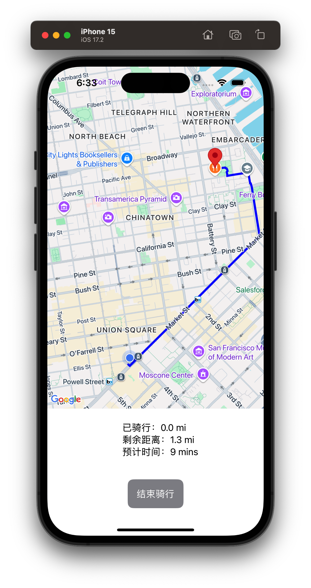
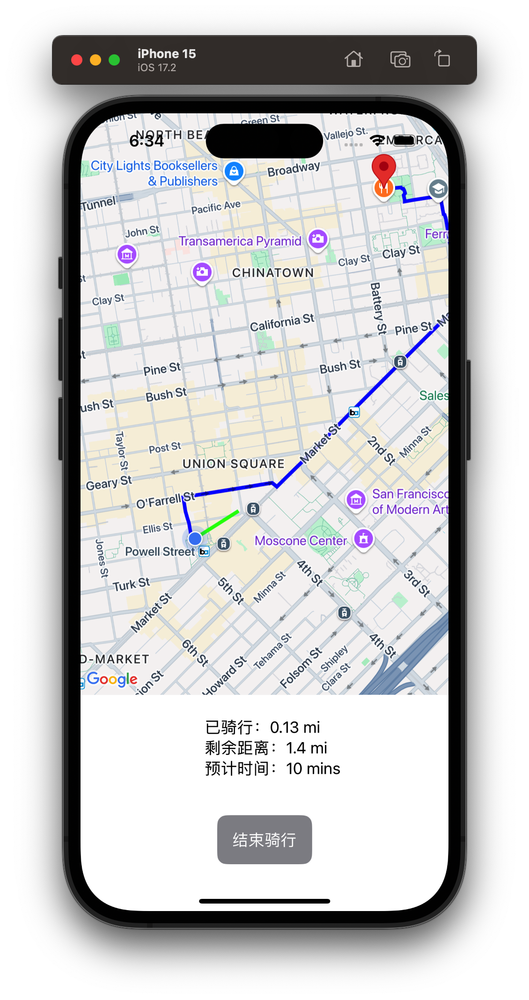
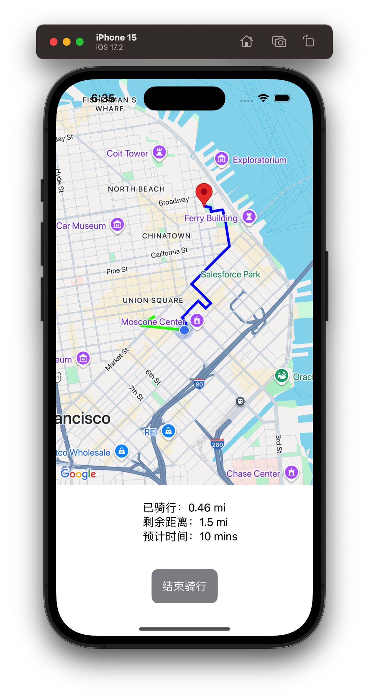

## 实现逻辑：
#### 1、使用 UIViewControllerRepresentable 将 GMSMapView 嵌入 SwiftUI 中
#### 2、使用 LocationManager 获取并管理当前位置。
#### 3、在地图上点击选择目的地后，通过google map 获取规划路径信息并绘制骑行路线。
#### 4、路径信息（已骑行距离、剩余距离、预估时间等）通过底部的 Text 显示。
#### 5、实时位置更新时，讲位置星系更新到路径，绘制实际骑行路径并调用google map接口获取规划路径信息。
#### 6、点击结束骑，清空数据和map信息，可重新选择目的地开始骑行

## 优化点
#### 1、可真机验证骑行路径做实时更新逻辑，可优化更新策略，避免频繁调用google map接口

## 运行结果：

